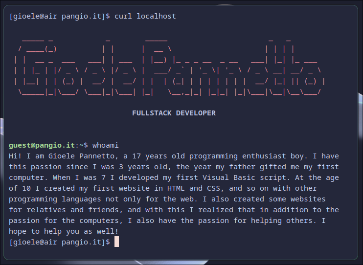
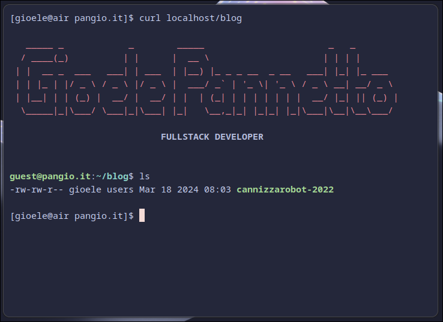
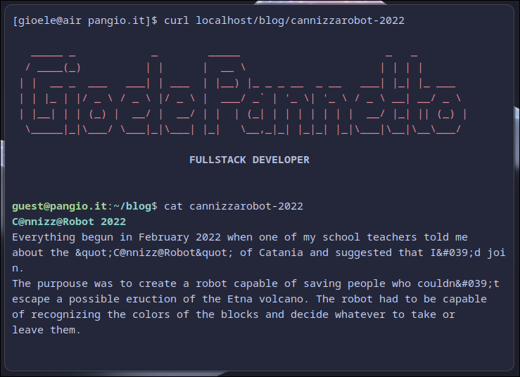

It's been a week since I started rewriting my personal website in Astro. I have to say it, I'm really enjoying this framework. But it's not been a smooth experience, here's some thoughts about it.

## History

Let's start from the beginning, this is my fourth time writing my website (giopan.dev v4, if you will). Here's a quick summary of the previous versions:
1) Static HTML/CSS
2) NextJS 
3) Laravel
4) Astro, this one

### The first version

The static version was hosted on a CPanel website I used to have, my very first public web server. It was... something. It was really easy to use and configure for a static website, but the moment you wanted something more, it would become a nightmare. I tried writing some PHP, but it was impossible to use any Composer package and I used to always occur in some strange configuration bug (probably caused by my inexperience).

### The second version

Some time passed and I discovered the magic world of NodeJS and NextJS, and that's when I decided to rewrite my portfolio. I also decided to rent a server on Akamai (former Linode, [here's a referral link](https://www.linode.com/lp/refer/?r=fec6c841e31eace9ea4c41dcab083b09c75eddba) that will give you 100$ credit for 60 days :wink: :wink:), this version worked fine... until I tried to deploy more websites on the same VPS and the RAM usage spiked to 90%. Nice, NodeJS at its finest.

_The source code of the website should still be online [here](https://github.com/GioPan04/pangio)_

### The third version

The third version was the longest-lived one so far, I discovered Laravel and I wanted to experiment with it, so v3 arrived. I had fun and all but, a Laravel website that has 2 pages and a blog, with a custom authentication system, a MySQL backend AND Redis for caching "just in case"... Yeah it was pretty overkill.

But this website had something truly beautiful: you could visit the website with curl and view a terminal friendly version of it. If you visited a post page it returned the markdown version and every other page had a text version + some decoration using bash formatting. Doing this was fairly easy, I had a laravel middleware that read the `User-Agent` HTTP header and handled the request accordingly returing a text-only view of the page. Honestly, it was amazing. I had some issues with the view caching of Laravel but I quickly resolved it.

_The source code of the website should still be online [here](https://github.com/GioPan04/pangio.it)_

## The present
The first time I heard about Astro was a year ago, but I was too in love with Laravel and so I ignored it. A week ago I wanted to add a post to my blog, but I got annoyed by the complexity of my own website, and so I said "Fuck it, I'm going to rewrite the whole website, once again."

I don't know where the idea of using Astro came from, but after a week of using it I can say that it was truly a great idea.

### Pros
- Their documentation is one of the best I've seen so far. Every functionality is well exaplained and common utilities includes well made tutorials. I never had to exit the documentation to understand how to do something, it's all there. Great work Astro team!
- Well integrated:
  - The `Astro` object contains useful utilities such as `Astro.glob` which returns a parsed version of the matching pages searched.
  - Markdown files can integrate well with the rest of the project: you can easly import components, images and other files. It's life changing.
- It's just static files, but not in the way you think, I'm talking about the ease of use that comes with it. I can easly deploy this website everywere, for example right now this website is deployed on GitHub Pages, and it's free! I have a GitHub action configured to auto build and deploy on every commit and in just 2 minutes an updated version is already live.

### Cons
I don't know how to explain it, but it looks like the vscode extension sometimes "dies" or "goes to sleep" (if you will): 
 - New files are never auto discovered and I have to write the path to the import manually
 - Sometimes the type of the `Astro` object is lost and it's shown as `any`

### Closing thoughts
I still haven't finished working on this website but I can say that i'm loving building it. Everything seems "natural" and how it should be. And the fact that I'm paying a buck for hosting makes me love it even more. See ya on v5!
